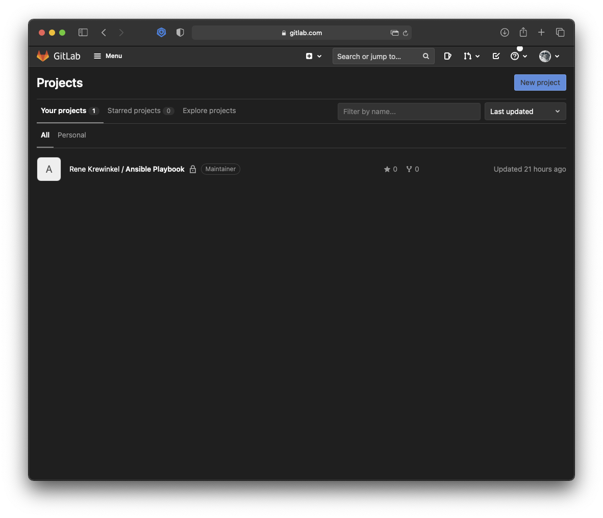
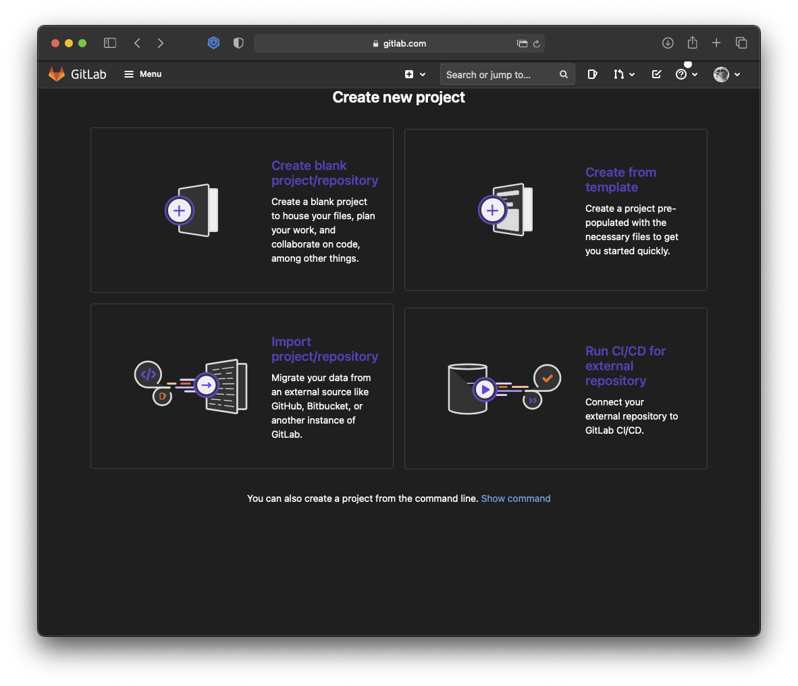
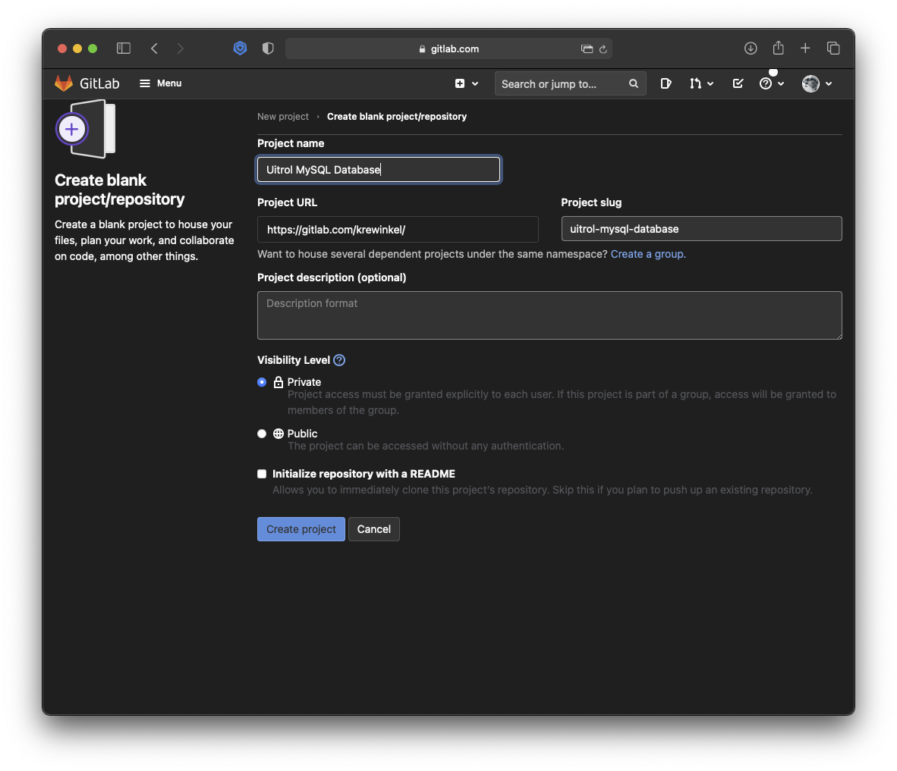
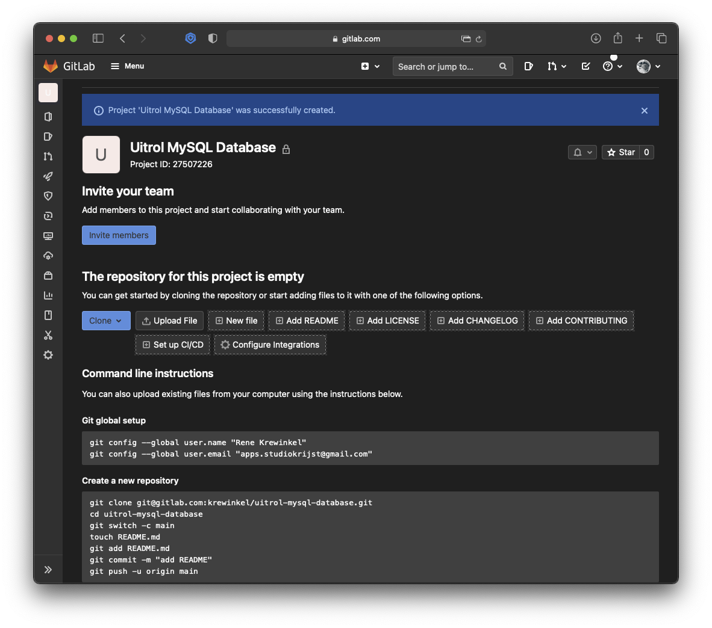
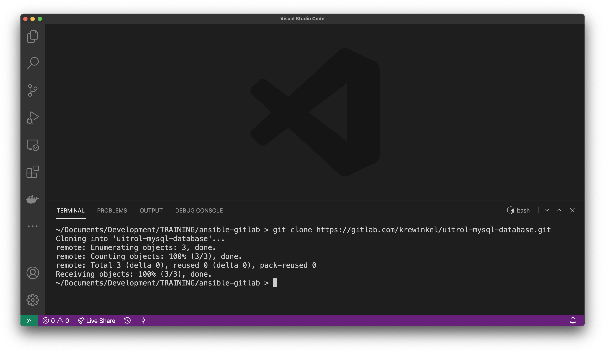
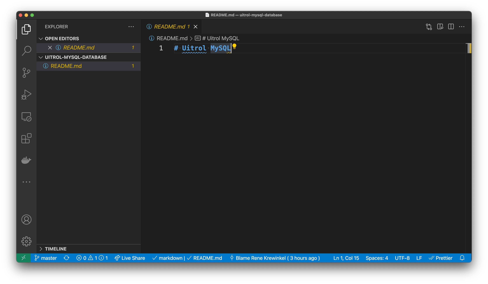
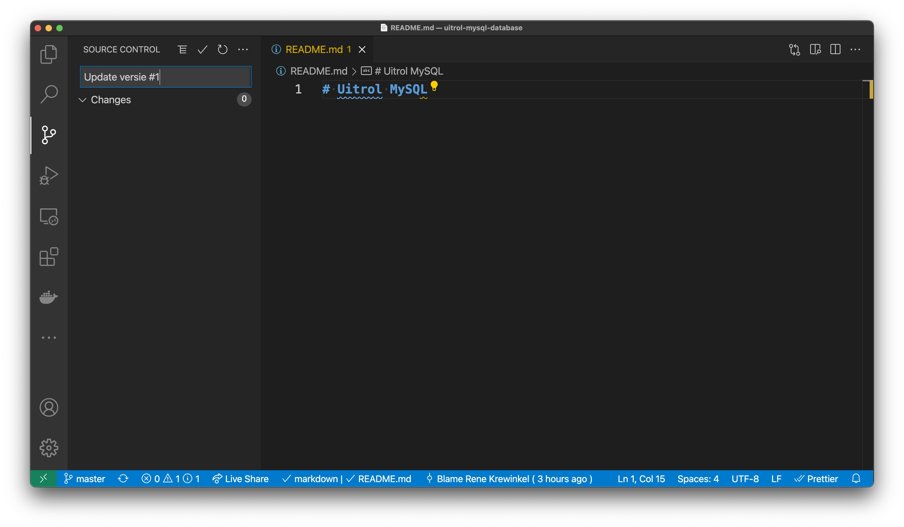
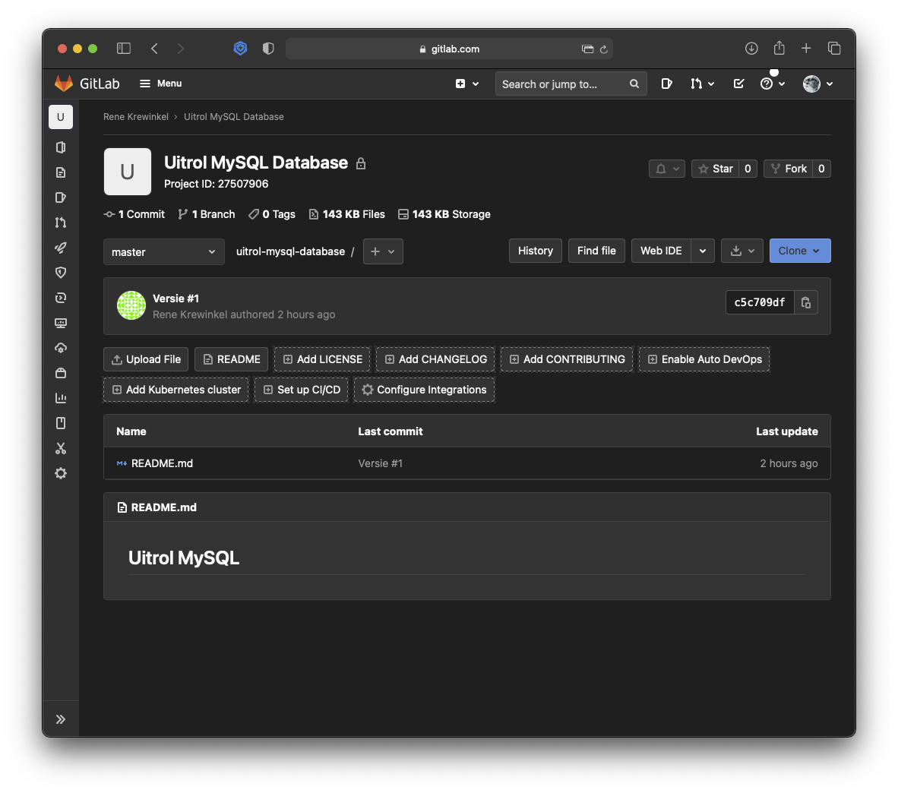

# Ansible & GitLab

1. [Setup](#setup)
2. [Overview / Architectuur](#overview--architectuur)
3. [Configuratie SSH](#configuratie-ssh)
4. [Inventory](#inventory)
5. [Commando's uitvoeren](#commandos-uitvoeren)
6. [Ansible Playbooks](#ansible-playbooks)
7. [Infrastructure as Code](#infrastructure-as-code)
8. [Configuratie GitLab](#configuratie-gitlab)
9. [Uitrollen MySQL & Database](#uitrollen-mysql--database)
10. [CommVault](#commvault)


## Setup
De installatie van Ansible op Linux (in dit geval Ubuntu) servers is redelijk straight forward. Het verdient de aanbeveling om een specifieke user aan te maken voor "*ansible werk*". Ansible maakt gebruik van `SSH` om remote acties uit te voeren. We zullen dus de firewalls voor `SSH` open moeten stellen. 

Voer onderstaande commando's uit op alle servers in de farm. 
> NB: Als hardware rollout mogelijk is, bijvoorbeeld in een VMWare omgeving met fysiek toegankelijke servers, dan kan dit ook via Ansible uitgerold worden.

```bash
# As root user

adduser ansible
# add a password and fill in the other fields (or not).

# grant sudo permissions to user: 
usermod -aG sudo ansible

# OPTIONAL
# Setup a basic firewall (if not already done)
ufw app list

# Output
Available applications:
  OpenSSH

ufw allow OpenSSH

ufw enable

ufw status

# Output 
Status: active

To                         Action      From
--                         ------      ----
OpenSSH                    ALLOW       Anywhere
OpenSSH (v6)               ALLOW       Anywhere (v6)
```

De installatie van ansible is op Ubuntu een eenvoudig proces: 
```bash
# as ansible user

# update repository
sudo apt update 

# install ansible
sudo apt install ansible 
```

## Overview / Architectuur
We gaan in deze workshop uit van de volgende 
configuraties: 

> Domain: **dba-training.online**

| Server | Taak | IP | 
|------|------| ---|
| server-a | Ansible Management server | 37.128.150.177 |
| server-b | Webserver | 37.128.150.147 |
| server-c | Webserver & MySQL Server | 37.128.150.252 |
| server-d | *Geen taak* | 185.57.8.20 |
| server-e | *Geen taak* | 185.57.8.188 |
| server-f | *Geen taak* | 37.128.150.31 |


## Configuratie SSH

Eerst moet een een SSH key gegenereerd worden om ssh-login naar de remote systemen mogelijk te maken. Deze key hebben we straks ook nodig om verbinding te maken met [GitLab](https://gitlab.com).

```bash
# as ansible user

# Generate a keypair
ssh-keygen

# Output: 
Generating public/private rsa key pair.
Enter file in which to save the key (/your_home/.ssh/id_rsa):

# press enter to save the key pair into the $HOME/.ssh directory
# If there is already a keypair, you will be asked to overwrite it. 
# The previous key *CANNOT BE USED ANYMORE*
# You should see the following prompt: 
Enter passphrase (empty for no passphrase):
# You can enter a passphrase for additional security

# Output will be something like this:
Your identification has been saved in /your_home/.ssh/id_rsa
Your public key has been saved in /your_home/.ssh/id_rsa.pub
The key fingerprint is:
SHA256:/hk7MJ5n5aiqdfTVUZr+2Qt+qCiS7BIm5Iv0dxrc3ks user@host
The keys randomart image is:'
+---[RSA 3072]----+
|                .|
|               + |
|              +  |
| .           o . |
|o       S   . o  |
| + o. .oo. ..  .o|
|o = oooooEo+ ...o|
|.. o *o+=.*+o....|
|    =+=ooB=o.... |
+----[SHA256]-----+
```
Vervolgens moet de `$HOME/.ssh/id-rsa.pub` file naar de ontvangende user/host gekopieerd worden: 

```bash
# as ansible user
ssh-copy-id [username]@[host]

# example
# You will be prompted to enter the host fingerprint in to 
# your $HOME/.ssh/known-hosts file

# You also will be prompted for the password of the remote user. 

ssh-copy-id root@server-a
ssh-copy-id ansible@server-a

# Once this is achieved you can ssh into the remote system 
# without a password, hence, ansible can perform it's 
# tasks without interuption
ssh root@server-b.dba-training.online
ssh ansible@server-b.dba-training.online
```
## Inventory
Het "default" inventaris van ansible is te vinden in `/etc/ansible/hosts` en hoewel dit een prima plek is om alles op te nemen, is het - zodra je geen root-access tot de machine hebt - niet mogelijk om hierin wijzigingen aan te brengen. 
Daarnaast verdient het de aanbeveling om ten alle tijden het ***KEEP IT SIMPLE*** devies te volgen. Naarmate de infrastructuur binnen de organisatie te complex (qua verwevenheid niet zozeer qua omvang) wordt, nemen niet alleen de *single points of failure* toe, maar worden de deployment scenario's ook meteen een stuk complexer. 
Het grote voordeel van het gebruik van Ansible op infrastructuur niveau is dat er kleine single-tasks virtual machines uitgerold kunnen worden waardoor er een minimale verwevenheid gecreëerd kan worden. 

Omdit issue het hoofd te kunnen bieden is het zaak om de infrastructuur goed in te delen. We kunnen dit doen door de invetaris lijst(en) gesegmenteerd in diverse files op te nemen. Bijvoorbeeld: 

```ini
# inventory/servers

[webservers]
server-b ansible_host=server-b.dba-training.online
server-c ansible_host=server-c.dba-training.online

[dbservers]
server-c ansible_host=server-c.dba-training.online

[all:vars]
ansible_python_interpreter=/usr/bin/python3

```
Als we het inventory commando vervolgens uitvoeren met deze config file als input, krijgen we het volgende te zien: 

```bash
ansible-inventory --inventory ./servers --list
```
```json
{
    "_meta": {
        "hostvars": {
            "server-b": {
                "ansible_host": "server-b.dba-training.online",
                "ansible_python_interpreter": "/usr/bin/python3"
            },
            "server-c": {
                "ansible_host": "server-c.dba-training.online",
                "ansible_python_interpreter": "/usr/bin/python3"
            }
        }
    },
    "all": {
        "children": [
            "dbservers",
            "ungrouped",
            "webservers"
        ]
    },
    "dbservers": {
        "hosts": [
            "server-c"
        ]
    },
    "webservers": {
        "hosts": [
            "server-b",
            "server-c"
        ]
    }
}
```


## Commando's Uitvoeren
We kunnen nu op onze inventory commando's uitvoeren. Stel we willen op onze webservers (in dit voorbeeld zowel server-b als server-c) daadwerkelijk een apache2 webserver installeren. 
We kunnen dat nu eenvoudig doen door op onze management server het volgende commando in te geven: 

```bash
ansible webservers -i servers -a "apt -y install apache2" -u root
```
Wat gebeurt hier nu: 
1. we filteren uit de inventory file `servers` de servers die onder `[webservers]` opgenomen zijn (in dit geval allebei).
2. met de `-a` flag zeggen we dat een commando uitgevoerd moet worden en tussen de quote's geven we aan welk commando dat is. In dit geval dus `apt -y install apache2` (het commando om op Ubuntu de apache2 webserver te installeren en "Yes" op alle vragen te antwoorden: de `-y` flag).
3. Dit moeten we op de remote machines als de `root` user doen, dus de `-u` flag geeft aan onder welke gebruiker we dit doen. 

Op dezelfde manier kunnen we nu bijvoorbeeld MySQL installeren op de `[dbservers]`: 
```bash
ansible dbservers -i servers -a "apt -y install mysql-server" -u root
```

## Ansible Playbooks

Een playbook is eigenlijk niet meer dan een set commando's die achter elkaar uitgevoerd moeten worden. Er zijn tal van mogelijkheden om complexe scenario's te verzinnen, maar op zich is ook hier een [***KISS***](https://nl.wikipedia.org/wiki/KISS-principe) approach in mijn optiek het beste. 

> "Simplicity is a prerequisite for reliability" - Edsger W. Dijkstra, 18 juni 1975

Beperk de playbooks tot de strikte handelingen die noodzakelijk zijn voor dat ene pakket en maak meerdere playbooks om complexere taken uit te voeren. 

Een playbook bestaat uit een of meerdere ***plays*** die op hun beurt weer uit een of meerdere taken kunnen bestaan. De syntax is een afgeleide van het zogenaamde `yaml` formaat, waarin een hierarchische onderverdeling van de content de groepering aangeeft. 

Onderstaand playbook illustreert dit: 

```yaml
# playbook.yml

- hosts: webservers
  become: true

  tasks:
    - name: Install Apache 2
      action: apt pkg=apache2 state=latest

    - name: Start the Apache2 Webserver
      action: service name=apache2 state=started

```
Vrij vertaald staat hier: 
Log in als `root` (`become` = `sudo`) op alle machines uit de inventory die gegroepeerd zijn als "webserver" en 
1. installeer het package "apache2" (webserver)
2. Start de webserver service 

Dit playbook kan vervolgens gestart worden door het commando: 

```bash
ansible-playbook -i inventory playbook.yml
```
waarbij de `-i` flag optioneel is (maar het verdient de aanbeveling om de inventory steeds mee te nemen in een playbook pakketje).

### BuiltIns
Er zijn een heleboel "builtins" beschikbaar om de playbooks diverse veel voorkomende taken te laten doen. Het voert wat ver om ze hier allemaal op te noemen, maar op de Ansible Documentatie site is alles terug te vinden. Inclusief voorbeelden. https://docs.ansible.com

### Bestanden kopieren
Een zeer praktische builtin, die je naar alle waarschijnlijkheid regelmatig zult gebruiken is `ansible.builtin.copy` hiermee kun je files van de management node naar de clients kopieren.
```yaml
- hosts: dbservers
  tasks:
        - name: Copy Initial Datafile
          ansible.builtin.copy:
                src: ./data.sql
                dest: /tmp/data.sql
                owner: ansible
                group: ansible
                mode: '0644'
```

Een shell commando (script o.i.d.) uitvoeren kan met de "builtin" `shell`
Bijvoorbeeld: 
```yaml
- hosts: webservers

  tasks:
    - name: Execute script
      shell: /home/ansible/deploy.sh > /dev/null
```

Ook voor errors geldt dat er uitgebreide mogelijkheden bestaan, deze zijn terug te vinden op [Ansible Errorhandling](https://docs.ansible.com/ansible/latest/user_guide/playbooks_error_handling.html)
Een basis voorbeeld, het zelfde script maar nu met een ignore van de error:
```yaml
- hosts: webservers

  tasks:
    - name: Execute script
      shell: /home/ansible/deploy.sh > /dev/null
      ignore_errors: yes
```
Bekijk het verschil in de uitvoer. 


### Community Packages
Ook binnen de community zijn diverse tools en packages te verkrijgen. Zo is er bijvoorbeeld een hele command set verkrijgbaar voor [MySQL](https://docs.ansible.com/ansible/latest/collections/community/mysql/mysql_db_module.html). 
Je kunt het installeren middels:
```bash
ansible-galaxy collection install community.mysql
```
Voorbeeld aanmaken database: 
```yaml
- hosts: dbservers
  become: true
  tasks:
        - name: Create a new database with name 'online_data'
          community.mysql.mysql_db:
                name: online_data
                state: present

```
Voorbeeld importeren van data: 
```yaml
- hosts: dbservers
  become: true
  tasks:
        - name: Create a new database with name 'online_data'
          community.mysql.mysql_db:
                name: online_data
                state: present
```
Voorbeeld exporteren van data (backup):
```yaml
- hosts: dbservers
  become: true
  tasks:
        - name: Dump Database Online Data
          community.mysql.mysql_db:
                name: online_data
                state: dump
                target: /tmp/dump.sql
```

## Infrastructure as Code

Door het gebruik van playbooks wordt het installeren en configureren van software, componenten, packages, containers etc. een handeling die vergaand geautomatiseerd kan worden. Hierdoor lijkt het steeds meer op het uitrollen van specifieke versies van software. 
Door het gebruik van GitLab (of github, bitbucket of eender welke variant), toch primair een tool voor versiebeheer t.a.v. software, maakt de deployment workflow analoog aan de workflow voor het uitrollen van nieuwe versies van software. Vandaar ook de term: "***Infrastructure as Code***". 

Het verdient ook aanbeveling om een code editor te gebruiken om de playbooks te maken en naar GitLab te pushen. Een editor als [Visual Studio Code](https://code.visualstudio.com) bijvoorbeeld, heeft het hele "*git*" fenomeen standaard ingebouwd, en ook de [YAML structuur](https://marketplace.visualstudio.com/items?itemName=redhat.vscode-yaml) van de playbooks kan als plugin opgenomen worden. 

### Hoe werkt git (in a nutshell)
Git is een "twee-traps raket", iedereen wijzigt zijn/haar code via een editor. En middels een zogenaamde `commit` worden de wijzigingen in de **LOKALE** repository (een bibliotheek op je laptop of netwerkschijf) weggeschreven. Zodra je een `push` commando geeft, worden de wijzigingen naar de **CENTRALE** repository (op GitLab) weggeschreven. Daar wordt gekeken of er conflicten zijn met informatie van anderen, en zo niet dan is dat de laatste status en versie van de code. 

Middels een `pull` commando download je de laatste versie van de centrale repository op en heb je alle wijzigingen van het hele team in je eigen omgeving. De functionaliteiten van `git` zijn natuurlijk veel uitgebreider en complexer, maar dit principe is genoeg als "***working knowledge***".

### Een repository opzetten
We gaan stap voor stap een repository opzetten en hier een playbook aan toevoegen. We gebruiken [Visual Studio Code](https://code.visualstudio.com)  als client tool om dit voor elkaar te krijgen. 

#### stap 1 - Een Repository Aanmaken
------
Login op GitLab en klik rechtsboven op `New project` en selecteer vervolgens `Create Blank Project`.




Geef het project een naam, bijvoorbeeld "Uitrol MySQL Database". De "project slug" wordt automatisch gevuld (dit is de URL waar we straks mee aan de slag moeten). Laat de rest van opties gewoon zoals ze zijn. 



Klik vervolgens op `Create Project`.

In het vervolgscherm zie je vervolgens de stappen die je moet uitvoeren om e.e.a. te koppelen: 



#### stap 2 - Visual Studio Configureren
------
Open Visual Studio en open een nieuwe terminal.

`cd` vervolgens naar de directory waarin je project moet komen te staan. 



"Clone" vervolgens het project met de URL die onder de "Clone" knop op GitLab staat. 

```bash
git clone https://gitlab.com/krewinkel/uitrol-mysql-database.git
```
Git maakt nu onder de huidige directory een directory aan met de naam (in dit geval) `uitrol-mysql-database` (de eerdere slug).

Open vervolgens deze folder in VS Code en voeg een file `README.md` toe aan het project.



Als er een wijziging is, zal het Source Control Icoontje oplichten en kan er ge-`commit` (lokale update) en ge-`push`-ed (remote update worden).



Nu kunnen we in ons project playbooks en inventories aanmaken en die naar GitLab pushen zodra het nodig is. 



## Configuratie GitLab

Als we op de server willen `clone`n en `pull`en zullen we eerstin GitLab een ssh key moeten aanmaken zodat we zonder meer repostories en playbooks kunnen pushen & pullen. In Gitlab klik je op je **(1) profile-icon** rechtsboven en selecteer vervolgens **Preferences**. In de selectie links, kies **(2) SSH Keys**

Plak in het veld **(3) Key** de inhoud uit `$HOME/.ssh/id-rsa.pub`. En klik vervolgens op **(4) Add Key**


We kunnen nu de repo "clonen" op onze server. Open de repository in GitLab en kopieer uit de **(5) clone** dropdown de regel onder **Clone with SSH (6)** 


en voer dit commando uit op de management server: 

```bash
# as ansible user
cd $HOME
mkdir deployment
cd deployment
# git clone git@gitlab.com:[user]/[repository].git
git clone git@gitlab.com:krewinkel/ansible-playbook.git

# where
# [user] is your GitLab username (in my case krewinkel)
# [repository] is your GitLab repository (im my case ansible-playbook)

# this will create a directory within `deployment` with 
# the same name as the repository
```

Nu kunnen we vanuit de `ansible-playbook` directory, met `git pull` de meest recente versie downloaden. Het meest praktische is het natuurlijk om dit in een deployment script op te nemen, zo weet je zeker dat je altijd de meest recente versie van het betreffende playbook(s) hebt.

## Uitrollen MySQL & Database
Playbook en [README](./deploy/README.md) in de deploy folder.


# CommVault
Er is een specifiek module beschikbaar voor CommVault. Deze Library is te vinden op [GitHub](https://github.com/Commvault/ansible).