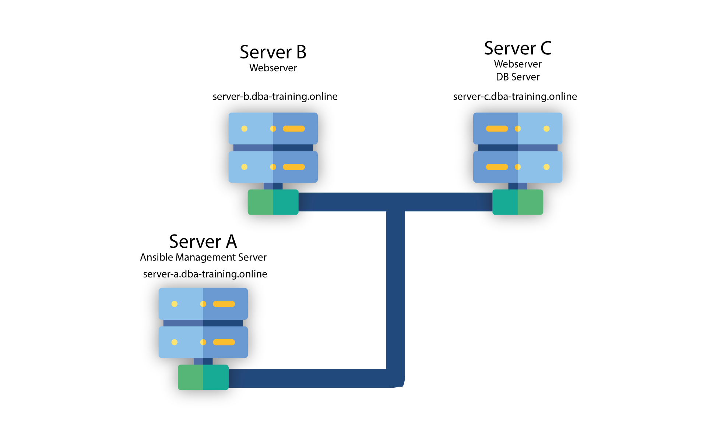

# Ansible & GitLab

1. [Setup](#setup)
2. [Overview / Architectuur](#overview--architectuur)
3. [Configuratie SSH](#configuratie-ssh)
4. [Inventory](#inventory)
5. [Commando's uitvoeren](#commandos-uitvoeren)
6. [Ansible Playbooks](#ansible-playbooks)
7. [Infrastructure as Code](#infrastructure-as-code)
8. [Configuratie GitLab](#configuratie-gitlab)
9. [Uitrollen MySQL & Database](#uitrollen-mysql--database)


## Setup
De installatie van Ansible op Linux (in dit geval Ubuntu) servers is redelijk straight forward. Het verdient de aanbeveling om een specifieke user aan te maken voor "*ansible werk*". Ansible maakt gebruik van `SSH` om remote acties uit te voeren. We zullen dus de firewalls voor `SSH` open moeten stellen. 

Voer onderstaande commando's uit op alle servers in de farm. 
> NB: Als hardware rollout mogelijk is, bijvoorbeeld in een VMWare omgeving met fysiek toegankelijke servers, dan kan dit ook via Ansible uitgerold worden.

```bash
# As root user

adduser ansible
# add a password and fill in the other fields (or not).

# grant sudo permissions to user: 
usermod -aG sudo ansible

# OPTIONAL
# Setup a basic firewall (if not already done)
ufw app list

# Output
Available applications:
  OpenSSH

ufw allow OpenSSH

ufw enable

ufw status

# Output 
Status: active

To                         Action      From
--                         ------      ----
OpenSSH                    ALLOW       Anywhere
OpenSSH (v6)               ALLOW       Anywhere (v6)
```

De installatie van ansible is op Ubuntu een eenvoudig proces: 
```bash
# as ansible user

# update repository
sudo apt update 

# install ansible
sudo apt install ansible 
```

## Overview / Architectuur
We gaan in deze workshop uit van de volgende 
configuraties: 

> Domain: **dba-training.online**

| Server | Taak | IP | 
|------|------| ---|
| server-a | Ansible Management server | 37.128.150.177 |
| server-b | Webserver | 37.128.150.147 |
| server-c | Webserver & MySQL Server | 37.128.150.252 |



## Configuratie SSH

Eerst moet een een SSH key gegenereerd worden om ssh-login naar de remote systemen mogelijk te maken. Deze key hebben we straks ook nodig om verbinding te maken met [GitLab](https://gitlab.com).

```bash
# as ansible user

# Generate a keypair
ssh-keygen

# Output: 
Generating public/private rsa key pair.
Enter file in which to save the key (/your_home/.ssh/id_rsa):

# press enter to save the key pair into the $HOME/.ssh directory
# If there is already a keypair, you will be asked to overwrite it. 
# The previous key *CANNOT BE USED ANYMORE*
# You should see the following prompt: 
Enter passphrase (empty for no passphrase):
# You can enter a passphrase for additional security

# Output will be something like this:
Your identification has been saved in /your_home/.ssh/id_rsa
Your public key has been saved in /your_home/.ssh/id_rsa.pub
The key fingerprint is:
SHA256:/hk7MJ5n5aiqdfTVUZr+2Qt+qCiS7BIm5Iv0dxrc3ks user@host
The keys randomart image is:'
+---[RSA 3072]----+
|                .|
|               + |
|              +  |
| .           o . |
|o       S   . o  |
| + o. .oo. ..  .o|
|o = oooooEo+ ...o|
|.. o *o+=.*+o....|
|    =+=ooB=o.... |
+----[SHA256]-----+
```
Vervolgens moet de `$HOME/.ssh/id-rsa.pub` file naar de ontvangende user/host gekopieerd worden: 

```bash
# as ansible user
ssh-copy-id [username]@[host]

# example
# You will be prompted to enter the host fingerprint in to 
# your $HOME/.ssh/known-hosts file

# You also will be prompted for the password of the remote user. 

ssh-copy-id root@server-a
ssh-copy-id ansible@server-a

# Once this is achieved you can ssh into the remote system 
# without a password, hence, ansible can perform it's 
# tasks without interuption
ssh root@server-a
ssh ansible@server-a
```
## Inventory
Het "default" inventaris van ansible is te vinden in `/etc/ansible/hosts` en hoewel dit een prima plek is om alles op te nemen, is het - zodra je geen root-access tot de machine hebt - niet mogelijk om hierin wijzigingen aan te brengen. 
Daarnaast verdient het de aanbeveling om ten alle tijden het ***KEEP IT SIMPLE*** devies te volgen. Naarmate de infrastructuur binnen de organisatie te complex (qua verwevenheid niet zozeer qua omvang) wordt, nemen niet alleen de *single points of failure* toe, maar worden de deployment scenario's ook meteen een stuk complexer. 
Het grote voordeel van het gebruik van Ansible op infrastructuur niveau is dat er kleine single-tasks virtual machines uitgerold kunnen worden waardoor er een minimale verwevenheid gecreëerd kan worden. 

Omdit issue het hoofd te kunnen bieden is het zaak om de infrastructuur goed in te delen. We kunnen dit doen door de invetaris lijst(en) gesegmenteerd in diverse files op te nemen. Bijvoorbeeld: 

```ini
# inventory/servers
# xxx.xxx.xxx.xxx = ip address of server

[webservers]
server-b ansible_host=xxx.xxx.xxx.xxx
server-c ansible_host=xxx.xxx.xxx.xxx

[dbservers]
server-c ansible_host=xxx.xxx.xxx.xxx

[all:vars]
ansible_python_interpreter=/usr/bin/python3

```
Als we het inventory commando vervolgens uitvoeren met deze config file als input, krijgen we het volgende te zien: 

```bash
ansible-inventory --inventory ./servers --list
```
```json
{
    "_meta": {
        "hostvars": {
            "server-b": {
                "ansible_host": "server-b.dba-training.online",
                "ansible_python_interpreter": "/usr/bin/python3"
            },
            "server-c": {
                "ansible_host": "server-c.dba-training.online",
                "ansible_python_interpreter": "/usr/bin/python3"
            }
        }
    },
    "all": {
        "children": [
            "dbservers",
            "ungrouped",
            "webservers"
        ]
    },
    "dbservers": {
        "hosts": [
            "server-c"
        ]
    },
    "webservers": {
        "hosts": [
            "server-b",
            "server-c"
        ]
    }
}


```


## Commando's Uitvoeren

## Ansible Playbooks

## Infrastructure as Code

## Configuratie GitLab

Eerst zullen we in GitLab een ssh key moeten aanmaken zodat we zonder meer repostories en playbooks kunnen pushen & pullen. In Gitlab klik je op je **(1) profile-icon** rechtsboven en selecteer vervolgens **Preferences**. In de selectie links, kies **(2) SSH Keys**

Plak in het veld **(3) Key** de inhoud uit `$HOME/.ssh/id-rsa.pub`. En klik vervolgens op **(4) Add Key**


<!--
Op de server moeten we ons nu "bekend" maken middels wat `git` tools: 

```bash
git config --global user.name "your_username"
git config --global user.email "your_email_address@example.com"

# Check
git config --global -list
```
-->

We kunnen nu de repo "clonen" op onze server. Open de repository in GitLab en kopieer uit de **(5) clone** dropdown de regel onder **Clone with SSH (6)** 


en voer dit commando uit op de management server: 

```bash
# as ansible user
cd $HOME
mkdir deployment
cd deployment
# git clone git@gitlab.com:[user]/[repository].git
git clone git@gitlab.com:krewinkel/ansible-playbook.git

# where
# [user] is your GitLab username (in my case krewinkel)
# [repository] is your GitLab repository (im my case ansible-playbook)

# this will create a directory within `deployment` with 
# the same name as the repository
```

Nu kunnen we vanuit de `ansible-playbook` directory, met 
`git pull` de meest recente versie downloaden. Het meest praktische is het natuurlijk om dit in een deployment script op te nemen, zo weet je zeker dat je altijd de meest recente versie van het betreffende playbook(s) hebt.

## Uitrollen MySQL & Database
